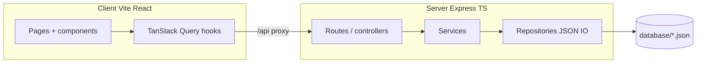

# AI coding lab: build the Learning Dashboard from scratch

**Audience:** Junior developers learning to ship real features with **AI coding assistants** (Cursor, GitHub Copilot, ChatGPT, Claude, etc.).

**Goal:** Recreate a production-style **monorepo**: React + Vite dashboard, Express + TypeScript API, JSON file persistence, validation, tests, and optional Docker—while practicing **how** to prompt, review, and integrate AI-generated code safely.

**Time estimate:** 3–6 focused days (varies by experience and how deep you go on tests/Docker).

---

## 1. What you will build

A small **project / learning task tracker** with:

- **Dashboard** with analytics cards (totals, completed, in progress, overdue, high priority).
- **Task list** with search and status filter.
- **Create / view / edit** tasks with owner pickers backed by seeded users.
- **JSON persistence** (no SQL database): tasks and users live in files under `database/`.
- **REST API** with predictable errors and validation.
- **Quality bar:** type safety, lint, automated tests, and a clean dev experience (`npm run dev` runs API + web).

This repository is the **reference implementation**. Your assignment is to **build an equivalent system** in a **new empty folder or repo** (do not copy-paste the whole tree at once—use AI incrementally as you would at work).

---

## 2. Why AI tools, and how to use them well

### 2.1 What “good” looks like

1. **You own the design.** AI suggests code; you decide architecture, names, and security.
2. **Small steps.** One endpoint, one component, one test file at a time.
3. **Always run** `npm test`, `npm run lint`, and manual checks after each merge from the assistant.
4. **Read diffs.** Never accept large blind chunks—especially around auth, `eval`, file paths, and dependencies.
5. **Keep prompts grounded.** Paste your `api-contract.md`-style spec, types, and error shapes into the chat.

### 2.2 Tool-agnostic workflow

| Phase | You | AI assistant |
| --- | --- | --- |
| Plan | Break work into milestones | Helps draft checklist, edge cases |
| Scaffold | Approve folder layout | Generates `package.json`, tsconfig, Vite template |
| API | Define routes + status codes | Generates handlers, Zod schemas, tests |
| UI | Define routes + states | Generates components; you tune UX |
| Harden | Run tests, fix bugs | Explains failures, proposes patches |

Works the same in **Cursor Agent**, **Copilot Chat**, **Claude Code**, or a **browser LLM**—adjust only *where* you paste files and *how* you apply patches.

---

## 3. Prerequisites

- **Node.js 20+** installed.
- **Git** basics (branch per feature optional but recommended).
- **HTTP/REST** familiarity (status codes, JSON).
- **React** fundamentals (components, hooks, `fetch` or a data library).

Optional reading in this reference repo (treat as **spec**, not something to paste verbatim):

- [`README.md`](../../README.md) — stack and scripts  
- [`api-contract.md`](../../api-contract.md) — endpoints and payloads  
- [`data-model.md`](../../data-model.md) — TypeScript shapes  
- [`acceptance-criteria.md`](../../acceptance-criteria.md) — Definition of done  
- [`design-notes.md`](../../design-notes.md) — architecture and overdue rules  
- [`ui-flow.md`](../../ui-flow.md) — screen behavior  

---

## 4. Expected result (visual)

When finished, your dashboard should feel like a **compact SaaS UI**: neutral slate background, **indigo** primary actions, semantic colors for risk (e.g. overdue), responsive cards, loading/empty/error states.

**All screens with component roles (single document):** **[`PROJECT_UI_WALKTHROUGH.md`](./PROJECT_UI_WALKTHROUGH.md)**. **Compact image gallery:** [`UI_MOCKUPS.md`](./UI_MOCKUPS.md).

Quick link — dashboard-only image (also in the mockups doc):


Capture your **own** screenshots from `http://localhost:5173` (or your chosen port) for your write-up or pull request.

---

## 5. Architecture you should target



**Layers to implement:**

| Layer | Responsibility |
| --- | --- |
| **Repositories** | Read/write JSON arrays atomically enough for a demo dataset |
| **Services** | Business rules (e.g. owner must exist, dashboard counts) |
| **Controllers / routes** | HTTP mapping, status codes, Zod validation errors |
| **Client hooks** | `fetch` + TanStack Query: queries + cache invalidation on mutations |
| **Pages** | Compose layout, loading/error/empty, forms |

---

## 6. API and data rules (must match)

Base path: `/api/...`

### 6.1 Endpoints

| Method | Path | Purpose |
| --- | --- | --- |
| `GET` | `/api/users` | List users (for owner `<select>` and display names) |
| `GET` | `/api/tasks` | List tasks |
| `GET` | `/api/tasks/:id` | Task detail; **404** `{ "message": "Task not found" }` |
| `POST` | `/api/tasks` | Create; **201** body is full task |
| `PUT` | `/api/tasks/:id` | Update (partial fields allowed at schema level if you use `.partial()`) |
| `PATCH` | `/api/tasks/:id/status` | Body `{ "status": "TODO" \| "IN_PROGRESS" \| "COMPLETED" }` |
| `GET` | `/api/dashboard` | Aggregated stats (shape below) |

Unknown routes: **404** JSON `{ "message": "Not found" }`.

### 6.2 Dashboard stats DTO

```json
{
  "totalItems": 0,
  "completedItems": 0,
  "inProgressItems": 0,
  "overdueItems": 0,
  "highPriorityItems": 0
}
```

### 6.3 Overdue rule (important for tests)

Implement **exactly** this logic on the server (paraphrased from the reference `DashboardService`):

- `completedItems` = count where `status === "COMPLETED"`.
- `inProgressItems` = count where `status === "IN_PROGRESS"`.
- `highPriorityItems` = count where `priority === "HIGH"` (all statuses unless you document otherwise; reference counts **all** high-priority tasks).
- `overdueItems` = count tasks where:
  - `status !== "COMPLETED"`, **and**
  - `new Date(task.dueDate) < startOfTodayUtc`, where `startOfTodayUtc` is **UTC midnight** of today’s calendar date (use `Date.UTC` with `getUTCFullYear`, `getUTCMonth`, `getUTCDate` from “now”).

This UTC-day-boundary rule keeps behavior deterministic across time zones and tests.

### 6.4 Task create body (minimum)

Required: `title`, `priority` (`LOW` \| `MEDIUM` \| `HIGH`), `ownerId` (must exist in users), `dueDate` (ISO-parseable).

Optional: `description` (default `""`), `category` (default `"General"`), `status` (default `TODO`).

On invalid owner: **400** `{ "message": "Owner not found" }`.

---

## 7. Step-by-step build plan (with example prompts)

Work in order. After **each** step: run the app or tests before moving on.

### Milestone A — Monorepo skeleton

**Outcome:** Root `package.json` with **npm workspaces** `client` and `server`; `npm run dev` runs both.

**Example prompt (paste into your AI tool):**

> Create an npm workspaces monorepo with two packages: `client` (React + TypeScript + Vite) and `server` (Express + TypeScript). Root scripts: `dev` uses concurrently to run `npm run dev -w server` and `npm run dev -w client`. Use Node 20. No extra frameworks beyond React Router, TanStack Query, Tailwind on the client, and Zod on the server.

**Verify:** `npm install` at root succeeds; empty server responds on a port; client opens in the browser.

**Reference files in this repo:** root [`package.json`](../../package.json).

---

### Milestone B — Database seed files

**Outcome:** `database/users.json` (≥ 5 users with `id`, `name`, `email`, `role`) and `database/tasks.json` (array, can start empty or seeded).

**Example prompt:**

> Add `database/users.json` and `database/tasks.json`. Provide five realistic users with stable string ids like `user-1`. Add a short README note that the API reads/writes these paths relative to repo root, and that tests should use an env var like `TEST_DATA_DIR` pointing at a temp folder so tests never corrupt dev data.

**Verify:** JSON validates; you can explain how paths resolve in dev vs tests.

**Reference:** [`database/users.json`](../../database/users.json).

---

### Milestone C — Repositories (JSON IO)

**Outcome:** `TaskRepository` and `UserRepository` with `list`, and for tasks `findById`, `create`, `update`, `updateStatus` (or equivalent names).

**Example prompt:**

> Implement repositories using `fs/promises`: read JSON array, mutate in memory, write back. Serialize writes or document single-process assumption. Support `TEST_DATA_DIR` override for integration tests.

**Verify:** Unit or integration test: write task, read back from “disk” in temp dir.

**Reference:** `server/src/repositories/*.ts`.

---

### Milestone D — Services + dashboard math

**Outcome:** `TaskService` enforces owner existence; `DashboardService` implements the overdue rules in section 6.3.

**Example prompt:**

> Implement DashboardService.getStats() with UTC start-of-day overdue logic and excluding completed tasks from overdue. Implement TaskService create/update with owner validation.

**Verify:** Vitest tests with **fixed dates** or injected clock if you want extra rigor; at minimum manual JSON cases.

**Reference logic:**

```typescript
// Pseudocode — implement in your repo, do not assume file paths match
function startOfTodayUtc(): Date {
  const d = new Date();
  return new Date(Date.UTC(d.getUTCFullYear(), d.getUTCMonth(), d.getUTCDate()));
}

// overdue: status !== COMPLETED && new Date(dueDate) < startOfTodayUtc()
```

---

### Milestone E — HTTP layer (Express + Zod)

**Outcome:** Mounted routers, consistent JSON errors, validation messages for Zod failures (`{ message, issues }` or your chosen consistent shape—document it).

**Example prompt:**

> Wire Express routes for /api/users, /api/tasks CRUD + PATCH status, /api/dashboard. Use Zod for request bodies. Return 404/400/201 appropriately. Add a global error handler that never leaks stack traces in JSON for production.

**Verify:** Use `curl` or Thunder Client against each route.

**Reference:** `server/src/routes/`, `server/src/controllers/`, `server/src/validators/`.

---

### Milestone F — Client: API client + TanStack Query

**Outcome:** Typed `fetch` wrappers (or a single `apiClient`) and hooks: `useUsers`, `useTasks`, `useTask(id)`, `useDashboard`, plus mutations that **invalidate** relevant queries.

**Example prompt:**

> Add TanStack Query QueryClientProvider at app root. Implement hooks for GET users/tasks/dashboard and mutations for POST/PUT/PATCH. On success, invalidate `["tasks"]`, `["task", id]`, `["dashboard"]` as appropriate.

**Verify:** Network tab shows calls; React Query Devtools optional.

---

### Milestone G — Routing and pages

**Outcome:** Routes aligned with [`ui-flow.md`](../../ui-flow.md):

| Path | Page |
| --- | --- |
| `/` | Dashboard |
| `/tasks` | List + search + filter |
| `/tasks/new` | Create form |
| `/tasks/:id` | Detail + quick status actions + demo delete modal (optional: no backend delete) |
| `/tasks/:id/edit` | Edit form |
| `*` | Friendly 404 |

**Example prompt:**

> Implement MainLayout with top navigation (Dashboard, Tasks, New task). Each page must handle loading, error with retry, and empty states per UX best practices. Use Tailwind with a slate + indigo palette.

**Verify:** Full happy path: create → detail → edit → list reflects changes.

**Reference:** `client/src/routes/index.tsx`, `client/src/pages/`.

---

### Milestone H — Vite proxy (critical for local dev)

**Outcome:** Browser calls **same-origin** `/api/...`; Vite proxies to Express (default reference uses port **4010** to avoid common collisions).

**Example prompt:**

> Configure Vite server.proxy so `/api` forwards to http://127.0.0.1:4010. Document PORT and API_PROXY_PORT env alignment.

**Verify:** No CORS hacks needed in dev; `GET /api/users` works from the UI.

**Reference:** [`client/vite.config.ts`](../../client/vite.config.ts).

---

### Milestone I — Tests

**Outcome:**

- **Server:** Supertest (or similar) integration tests hitting the app with `TEST_DATA_DIR`.
- **Client:** React Testing Library for at least create/edit flows or critical forms.

**Example prompt:**

> Add Vitest to both workspaces. Server: spin up app in test with temp JSON fixtures. Client: test CreateTaskPage submits and shows validation errors from mocked fetch or MSW.

**Verify:** `npm run test` passes at root.

---

### Milestone J — Docker (optional stretch)

**Outcome:** `docker compose up --build` serves UI (nginx or static) and API; `/api` proxied from the web container; `./database` mounted as a volume.

**Example prompt:**

> Multi-stage Dockerfile for server. Nginx config for SPA + `/api` proxy. docker-compose with `api` and `web` services; mount database directory read-write.

**Verify:** Tasks persist on host after container restart.

**Reference:** [`docker-compose.yml`](../../docker-compose.yml), [`client/nginx.conf`](../../client/nginx.conf).

---

## 8. AI prompt templates you can reuse

**Planning**

> Here is my API contract (paste). List implementation milestones, risks, and test cases for dashboard overdue logic.

**Implementation**

> Implement only `PATCH /api/tasks/:id/status` with Zod and tests. Do not change unrelated files.

**Debugging**

> I get `EADDRINUSE` on port 4010. Explain likely causes and how to fix on macOS without changing unrelated code.

**Review**

> Review this diff for security issues (path traversal, unsafe JSON parse, missing validation). Suggest minimal fixes.

---

## 9. Deliverables (submit to your mentor)

1. **Git repository** (or zip) with your solution—not a fork of the reference if your employer forbids it; a clean repo is fine.
2. **`README.md`** with setup, scripts, ports, and troubleshooting (proxy, ports).
3. **Screenshots:** dashboard + task list + create form (from *your* build).
4. **Short reflection (½–1 page):** what worked with AI, what failed, how you verified code, one thing you would do differently.
5. **Evidence tests ran:** paste output snippet or CI link.

---

## 10. Rubric (how you will be graded)

| Area | Excellent | Needs work |
| --- | --- | --- |
| **Spec match** | All endpoints + dashboard rules match contract | Drift in status codes or overdue logic |
| **AI hygiene** | Small prompts, reviewed diffs, no mystery deps | Huge unreviewed patches |
| **UX** | Loading/error/empty + accessible forms | Blank screens on failure |
| **Quality** | Lint + tests green | Flaky or missing tests |
| **Communication** | README + reflection clear | Hard to run locally |

---

## 11. Integrity and learning

- **Building yourself** (with AI help) is the assignment—**not** submitting this reference repo as your own.
- You **may** read this repo’s docs and compare behavior after you implement.
- If your course allows **comparing** snippets, cite what you learned—don’t plagiarize prose.

---

## 12. Optional extensions

- Real **delete** endpoint with confirmation in UI.
- **Pagination** or server-side filtering when `tasks.json` grows.
- **GitHub Actions** CI running lint + test + build on push.
- **OpenAPI** spec generated from Zod schemas.

---

## 13. Quick reference — key scripts (match in your repo)

| Command | Intent |
| --- | --- |
| `npm install` | Install all workspaces |
| `npm run dev` | API + client together |
| `npm run build` | Production builds |
| `npm run test` | All tests |
| `npm run lint` | Lint / typecheck as configured |

---

**Document version:** 1.0  
**Maintainer note:** Update ports or file paths here if the reference repo changes.
