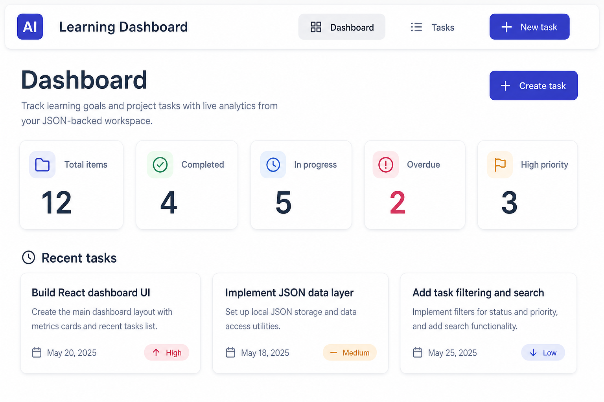
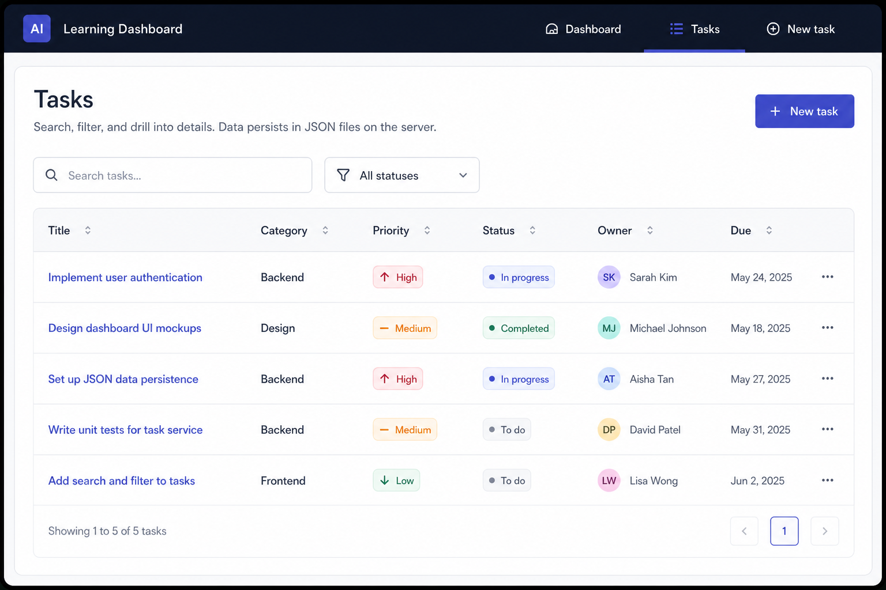
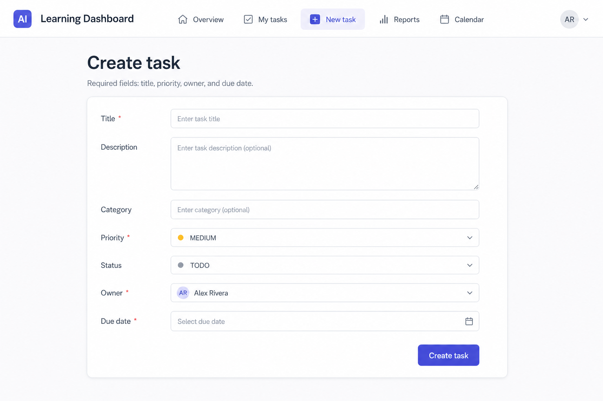
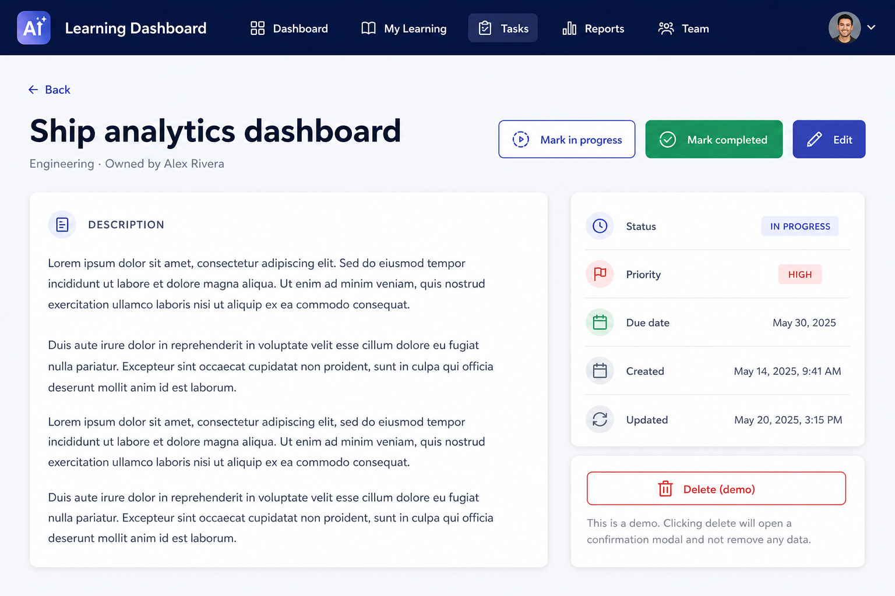
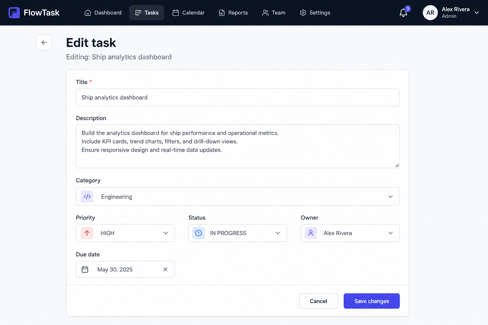
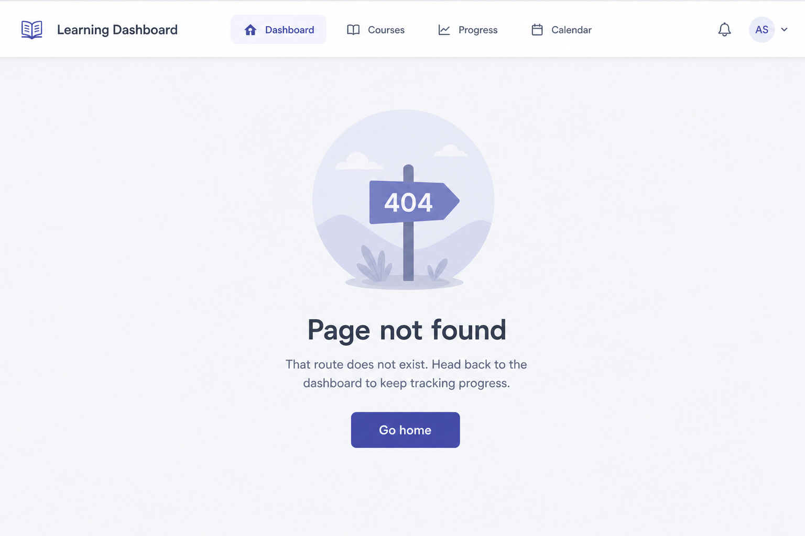

# Project UI walkthrough — Learning Dashboard

**PDF version:** [`PROJECT_UI_WALKTHROUGH.pdf`](./PROJECT_UI_WALKTHROUGH.pdf) (same content; regenerate from repo root with `python3 scripts/generate-walkthrough-pdf.py` after `pip install markdown`).

This is a **single-document tour** of the Learning Dashboard front end: every main screen is shown with a **mockup image**, followed by an explanation of the **UI pieces on that screen** and **what role each piece plays** in the product (data, navigation, and user goals).

**How to read this doc**

- Images are **illustrative AI mockups** stored under [`ui-mockups/`](./ui-mockups/); they match the app’s structure and copy closely, not necessarily every pixel of the running UI.
- Component names refer to the **reference implementation** under `client/src/`.
- For API behavior behind the UI, see [`../../api-contract.md`](../../api-contract.md) and [`../../ui-flow.md`](../../ui-flow.md).

---

## How the UI is organized (big picture)

The React app uses **React Router** for URLs and a shared **`MainLayout`** so every “real” page feels like one product: same header, same content width, same visual language (Tailwind: slate neutrals, indigo primary, semantic greens/reds where needed).

| Layer | Role |
| --- | --- |
| **`MainLayout`** | Wraps all main routes: renders global chrome once, then `<Outlet />` for the active page. |
| **Pages** (`client/src/pages/*`) | Load data (via TanStack Query hooks), handle loading/error/empty, and compose smaller components. |
| **Presentational components** (`client/src/components/*`) | Reusable UI: tables, forms, cards, modals—kept mostly free of routing logic. |
| **Hooks** (`client/src/hooks/*`) | Encapsulate `fetch` + cache keys + invalidation so pages stay readable. |

Data flows **browser → Vite dev proxy `/api` → Express server → JSON files**; the UI never talks to the filesystem directly.

---

## Global shell: navigation and layout

Before any page-specific content, users always see the **top navigation** and a centered **content column**.

### `NavigationBar`

**File:** `client/src/components/NavigationBar.tsx`

**Role:** Primary **wayfinding** across the app. It exposes the product identity (logo mark + “Learning Dashboard”) and three **NavLink** entries: **Dashboard** (`/`), **Tasks** (`/tasks`), and **New task** (`/tasks/new`). Active routes get visible emphasis so users know where they are. This component is the main **entry point** to every feature without hunting URLs.

### `MainLayout`

**File:** `client/src/layouts/MainLayout.tsx`

**Role:** Structural consistency: full-height column, `NavigationBar` at top, then `<main>` with `max-w-6xl` padding. Every routed page under this layout automatically **aligns** to the same grid—important for a polished “internal tool / SaaS” feel and for responsive behavior.

---

## Screen 1 — Dashboard (`/`)

The dashboard answers: **“How is my work going overall, and what should I look at next?”**

**Page:** `client/src/pages/DashboardPage.tsx`

### What loads here

The page fetches **three things in parallel**: dashboard stats (`useDashboard` → `GET /api/dashboard`), the task list (`useTasks` → `GET /api/tasks`), and users (`useUsers` → `GET /api/users`). Users are needed to **resolve owner names** on task cards without hardcoding IDs.

### `PageHeader`

**File:** `client/src/components/PageHeader.tsx`

**Role:** Standard **title + subtitle + optional actions** strip at the top of most pages. On the dashboard it sets context (“what is this screen?”) and hosts the primary **Create task** link—driving users toward the most common next action.

### `DashboardCards` (includes inner `StatCard`)

**File:** `client/src/components/DashboardCards.tsx`

**Role:** Turns **`DashboardStats`** from the API into five **at-a-glance metrics**: total tasks, completed, in progress, overdue, and high priority. Each card is a small **decision-support** unit (e.g. overdue count highlights risk). The numbers are **server-computed** so the UI stays thin and every client sees the same rules (notably **overdue vs UTC midnight** on the server).

### “Recent tasks” section + `TaskCard`

**Files:** `DashboardPage.tsx` (slices first 3 tasks), `client/src/components/TaskCard.tsx`

**Role:** Gives **concrete examples** behind the metrics—not just counts. Each `TaskCard` shows title, due date, owner, priority pill, truncated description, status, and links to **detail**. This bridges analytics (“how many?”) to **actionable items** (“which tasks?”).

### `LoadingState` / `ErrorState` / `EmptyState` (on this page)

**Files:** `LoadingState.tsx`, `ErrorState.tsx`, `EmptyState.tsx`

**Role:** **Trust and clarity** while data is in flight or missing. Loading shows a spinner with polite `aria-live`. Errors show a retry path (`refetch`) so a blip does not strand the user. Empty recent tasks nudges toward **Create task**—guiding juniors toward the “happy path” when the database is empty.

---

## Screen 2 — Task list (`/tasks`)

The task list answers: **“Show me everything I can filter and search, and let me open any task.”**

**Page:** `client/src/pages/TaskListPage.tsx`

### `PageHeader` + “New task”

Same `PageHeader` pattern: title **Tasks**, explanatory subtitle about JSON persistence, and **New task** as the main CTA—consistent with the dashboard.

### `SearchBar`

**File:** `client/src/components/SearchBar.tsx`

**Role:** **Client-side keyword filter** across title, description, and category (see `matchesSearch` in `client/src/utils/taskFilters.ts`). It makes the list usable as the task corpus grows, without extra API surface. Accessible label via `sr-only` “Search”.

### `StatusFilter`

**File:** `client/src/components/StatusFilter.tsx`

**Role:** **Client-side status filter** (`ALL`, `TODO`, `IN_PROGRESS`, `COMPLETED`). Combined with search, users can narrow to “everything in progress matching ‘API’”. Keeps the server simple (single list endpoint).

### `TaskTable`

**File:** `client/src/components/TaskTable.tsx`

**Role:** The **dense operational view** of work: sortable-feeling table layout with **priority** and **status** as color-coded pills, **owner** names from `usersById`, due dates, and **View** links into **`/tasks/:id`**. Title cells are links—fast scanning + navigation in one control.

### Empty states on this page

Two cases: **no tasks at all** (CTA to create) vs **no rows after filter** (“No matches”)—teaches juniors that **empty** is not always the same UX problem.

---

## Screen 3 — Create task (`/tasks/new`)

Create task answers: **“Capture a new piece of work with valid owner and dates.”**

**Page:** `client/src/pages/CreateTaskPage.tsx`  
**Form:** `client/src/components/TaskForm.tsx`

### `PageHeader`

Explains **required fields** (title, priority, owner, due date) so validation errors feel fair, not arbitrary.

### `TaskForm` (mode `"create"`)

**Role:** The **single source of truth** for task field layout for both create and edit. Fields map to the **POST /api/tasks** contract: title, description, category, priority, status, `ownerId` (select populated from `GET /api/users`), due date (`datetime-local` converted to ISO in the page before submit). The form surfaces **inline error** from page-level validation or API failures (`role="alert"`).

### Why this page matters in the project

It is the first **write path** juniors implement end-to-end: form → mutation (`useCreateTask`) → cache invalidation → **redirect to detail** on success. That pattern repeats across many products.

---

## Screen 4 — Task detail (`/tasks/:id`)

Task detail answers: **“What exactly is this task, what state is it in, and what can I do right now?”**

**Page:** `client/src/pages/TaskDetailPage.tsx`

### `PageHeader` as “task hero”

Here the **title is the task title**, subtitle shows **category** and **owner name**—context dense enough to replace a separate “breadcrumb” in a small app.

### Quick action buttons

**Role:** **Mark in progress** and **Mark completed** call **`PATCH /api/tasks/:id/status`** via `usePatchTaskStatus`. They are the fastest path for **status hygiene** without opening the full editor. **Edit** links to **`/tasks/:id/edit`**.

### Description panel + metadata sidebar

**Role:** Left: long-form **description** (or em dash if empty). Right: read-only **Status, Priority, Due, Created, Updated**—audit trail for “when did this change?”. This split matches how people read: narrative first, facts second.

### `SuccessToast`

**File:** `client/src/components/SuccessToast.tsx`

**Role:** After a successful status patch, gives **lightweight confirmation** without blocking the page—better than silent success for learnability.

### “Delete (demo)” + `ConfirmationModal`

**Files:** `TaskDetailPage.tsx`, `client/src/components/ConfirmationModal.tsx`

**Role:** Demonstrates **destructive-action UX** (confirm, danger styling) even though the reference API **does not implement DELETE**. For juniors, this is a deliberate lesson: **UI patterns can exist ahead of backend**, but copy must be honest (modal description explains no real delete).

---

## Screen 5 — Edit task (`/tasks/:id/edit`)

Edit task answers: **“Change multiple fields safely and persist them.”**

**Page:** `client/src/pages/EditTaskPage.tsx`  
**Form:** `TaskForm` (mode `"edit"`)

### `PageHeader`

Shows **Edit task** and a subtitle with the task title so users confirm **which record** they are editing—important when many tabs or similar titles exist.

### `TaskForm` (mode `"edit"`)

**Role:** Same layout as create with **`defaultValues`** prefilled from `useTask`. Submit runs **`PUT /api/tasks/:id`** via `useUpdateTask`, then navigates back to **detail**. Reusing one form **reduces drift** between create and edit (one place to fix labels, validation messaging, and accessibility).

---

## Screen 6 — Page not found (`*`)

The 404 screen answers: **“You hit a bad URL—here is a safe way back.”**

**Page:** `client/src/pages/NotFoundPage.tsx`

### `EmptyState` reused for errors

**Role:** Instead of a bare browser 404, the app renders a **friendly card** with title **Page not found**, short explanation, and **Go home** (`/`). This completes the **routing story** for juniors: happy paths + **graceful failure** for mistyped links or stale bookmarks.

---

## Cross-cutting components (everywhere)

These appear on multiple screens; understanding them completes the walkthrough.

| Component | File | Role in the project |
| --- | --- | --- |
| **`LoadingState`** | `LoadingState.tsx` | Predictable **pending UI** for any async query; avoids layout jump and sets expectations. |
| **`ErrorState`** | `ErrorState.tsx` | **Recoverable failure** UI with optional retry; uses alert semantics for screen readers. |
| **`EmptyState`** | `EmptyState.tsx` | **Zero-data** and **zero-results** UX with optional CTA—teaches that “empty” is a designed state, not a bug. |
| **`PageHeader`** | `PageHeader.tsx` | Consistent **page identity** and optional **primary actions**—reduces bespoke headers per page. |
| **`TaskForm`** | `TaskForm.tsx` | Shared **create/edit** surface—single implementation of labels, inputs, and submit layout. |
| **`ConfirmationModal`** | `ConfirmationModal.tsx` | Reusable **modal shell** for irreversible or sensitive actions (here: demo delete). |

---

## Route map (quick reference)

| Route | Page component | Primary user goal |
| --- | --- | --- |
| `/` | `DashboardPage` | See metrics + recent work |
| `/tasks` | `TaskListPage` | Browse, search, filter all tasks |
| `/tasks/new` | `CreateTaskPage` | Add a task |
| `/tasks/:id` | `TaskDetailPage` | Inspect + quick status changes |
| `/tasks/:id/edit` | `EditTaskPage` | Full edit |
| `*` | `NotFoundPage` | Recover from bad URLs |

Router wiring: `client/src/routes/index.tsx`.

---

## What juniors should do with this document

1. **Trace each screenshot** to the matching **page file** and list which **components** are composed there.
2. **For each button or link**, name the **HTTP method + path** (or client-side filter) it triggers.
3. **Replace mockups** with screenshots from their own build once the UI exists—this file is a **map**, not a submission artifact.

---

## Image index (all embedded above)

| # | Image file | Section |
| --- | --- | --- |
| 1 | [`ui-mockups/ui-01-dashboard.png`](./ui-mockups/ui-01-dashboard.png) | Dashboard |
| 2 | [`ui-mockups/ui-02-tasks-list.png`](./ui-mockups/ui-02-tasks-list.png) | Task list |
| 3 | [`ui-mockups/ui-03-create-task.png`](./ui-mockups/ui-03-create-task.png) | Create task |
| 4 | [`ui-mockups/ui-04-task-detail.png`](./ui-mockups/ui-04-task-detail.png) | Task detail |
| 5 | [`ui-mockups/ui-05-edit-task.png`](./ui-mockups/ui-05-edit-task.png) | Edit task |
| 6 | [`ui-mockups/ui-06-not-found.png`](./ui-mockups/ui-06-not-found.png) | Not found |

---

*Document version: 1.0 — companion to [`AI_CODING_LAB.md`](./AI_CODING_LAB.md).*
